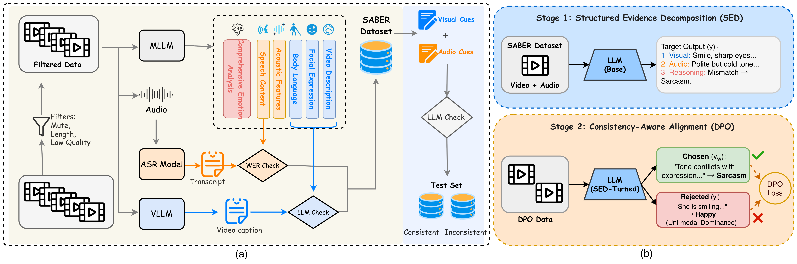
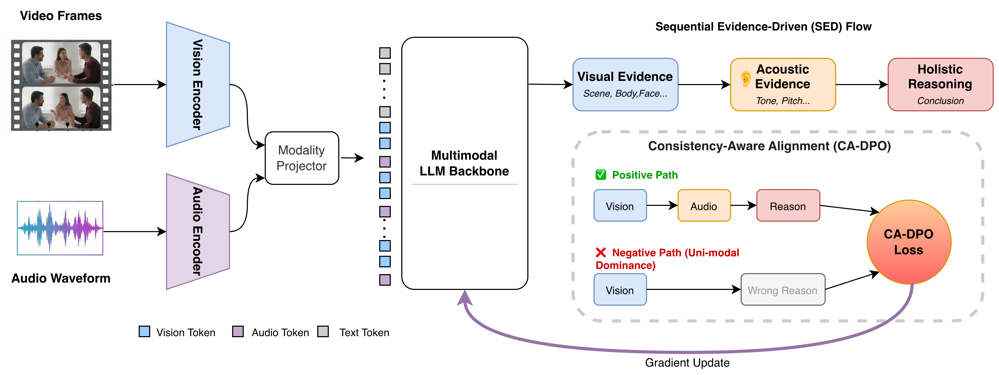

# Integrating Fine-Grained Audio-Visual Evidence for Robust Multimodal Emotion Reasoning (SABER-LLM)

This is the official implementation of the paper: **"Integrating Fine-Grained Audio-Visual Evidence for Robust Multimodal Emotion Reasoning"**. 

---

## 💡 Key Contributions

*   **SABER Dataset**: A large-scale multimodal emotion reasoning dataset containing ~**600K** video clips, featuring a unique six-dimensional annotation schema.
*   **SED Paradigm**: **Structured Evidence Decomposition** forces the model to disentangle and analyze uni-modal evidence (Visual, Acoustic, etc.) before synthesizing a final emotional conclusion.
*   **CA-DPO**: **Consistency-Aware Direct Preference Optimization** refines the model's judgment in modality-conflicting scenarios (e.g., a "sarcastic smile" with a "hostile tone").
*   **SOTA Performance**: Outperforms existing open-source baselines on EMER, EmoBench-M, and SABER-Test.

---

## 📊 Data Pipeline and Model Architecture

Our data construction pipeline integrates a unified fine-grained annotation strategy with automated quality control mechanisms across three stages.

*Figure 1: (a) Overview of the SABER data pipeline, featuring Raw Data Cleaning, Fine-grained Multimodal Annotation, and Instruction Generation. (b) Training Paradigm: Stage 1 (SED) for sequential grounding and Stage 2 (CA-DPO) for preference alignment in conflicting scenarios.**

---

SABER-LLM utilizes a two-stage training paradigm to ensure robust evidence grounding.

### Six-Dimensional Annotation Schema
1.  **Video Description**: Macro scene context.
2.  **Facial Expression**: Micro-expressions and gaze.
3.  **Body Language**: Posture, gestures, and social signals.
4.  **Acoustic Features**: Prosody, pitch, and tonal intensity.
5.  **Speech Content**: Verbatim transcripts and semantic info.
6.  **Multimodal Emotion Analysis**: Final holistic reasoning and causal logic.

---

## 📅 To-Do List

- [ ] Release SABER-Test benchmark (1,800 clips)
- [x] Release SABER-LLM-7B model weights
- [ ] Release the full SABER training dataset (600K clips)
- [ ] Provide automated data annotation scripts
- [ ] Quick Start and Inference Example scripts

---

## ✨ Model Weights

The SABER-LLM-7B model weights are now available on Hugging Face!

You can download them from the following repository:
[https://huggingface.co/zhaoxiaoxian/SABER-LLM](https://huggingface.co/zhaoxiaoxian/SABER-LLM)

---
