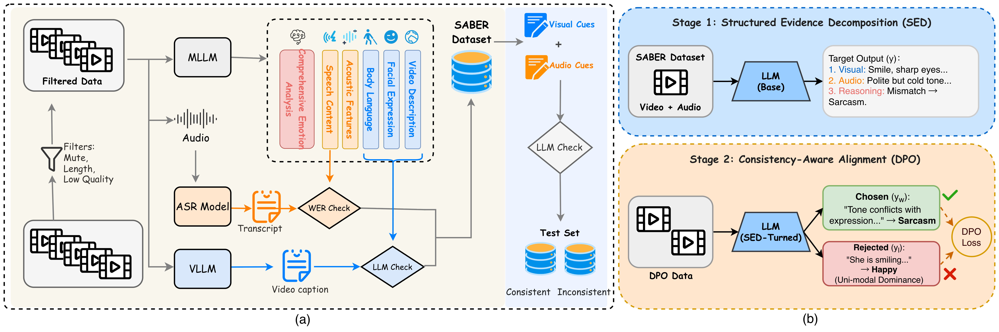
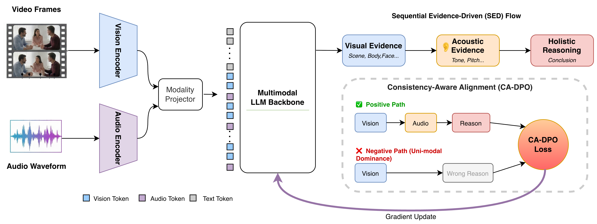

# Integrating Fine-Grained Audio-Visual Evidence for Robust Multimodal Emotion Reasoning

This is the official implementation of the paper: **"Integrating Fine-Grained Audio-Visual Evidence for Robust Multimodal Emotion Reasoning"**. 

[](https://arxiv.org/abs/2601.18321)
[](https://huggingface.co/zhaoxiaoxian/SABER-LLM)
[](https://huggingface.co/datasets/zhaoxiaoxian/SABER-Dataset)

---
## 💡 Key Contributions

* **SABER Dataset**: A large-scale multimodal emotion reasoning dataset containing ~**600K** video clips, featuring a unique six-dimensional annotation schema.
* **SED Paradigm**: **Structured Evidence Decomposition** forces the model to disentangle and analyze uni-modal evidence (Visual, Acoustic, etc.) before synthesizing a final emotional conclusion.
* **CA-DPO**: **Consistency-Aware Direct Preference Optimization** refines the model's judgment in modality-conflicting scenarios (e.g., a "sarcastic smile" with a "hostile tone").
* **SOTA Performance**: Outperforms existing open-source baselines on EMER, EmoBench-M, and SABER-Test.

---
## 🔗 Resources

* **Paper**: [https://arxiv.org/abs/2601.18321](https://arxiv.org/abs/2601.18321)
* **Model Weights (7B)**: [https://huggingface.co/zhaoxiaoxian/SABER-LLM](https://huggingface.co/zhaoxiaoxian/SABER-LLM)
* **Training Dataset**: [https://huggingface.co/datasets/zhaoxiaoxian/SABER-Dataset](https://huggingface.co/datasets/zhaoxiaoxian/SABER-Dataset)
* **GitHub**: [https://github.com/zxzhao0/SABER-LLM](https://github.com/zxzhao0/SABER-LLM)

---
## 📚 The SABER Dataset

SABER (Scene, Audio, Body, Expression, and Reasoning) is a large-scale emotion reasoning dataset designed to shift multimodal emotion analysis from static classification to generative reasoning. It mitigates uni-modal dominance and hallucinations by grounding reasoning in observable multimodal evidence.

* **Scale:** ~600K video clips.
* **Languages:** Chinese (CN) and English (EN).
* **Modalities:** Video and Audio (V+A).

### Data Structure
The dataset is provided in JSON format. Each entry contains fine-grained annotations decoupled into explicit visual and acoustic evidence, followed by holistic reasoning.

```json
{
    "audio_desc": {
        "speech_content": "....",
        "acoustic_feat": "...."
    },
    "video_desc": "....",
    "facial_exp_desc": "....",
    "body_lang_desc": "....",
    "sentiment_analysis": "...."
}
```

### Source Datasets & Related Work
SABER aggregates and builds upon several foundational multimodal datasets. Below are the key datasets incorporated:

* **CREMA-D:** Houwei Cao, David G. Cooper, Michael K. Keutmann, Ruben C. Gur, Ani Nenkova, and Ragini Verma, "CREMA-D: crowd-sourced emotional multimodal actors dataset," IEEE Trans. Affect. Comput., vol. 5, no. 4, pp. 377-390, 2014.
* **MEAD:** Kaisiyuan Wang, Qianyi Wu, Linsen Song, Zhuoqian Yang, Wayne Wu, Chen Qian, Ran He, Yu Qiao, and Chen Change Loy, "Mead: a large-scale audio-visual dataset for emotional talking-face generation," in ECCV, 2020, pp. 700-717.
* **MELD:** Soujanya Poria, Devamanyu Hazarika, Navonil Majumder, Gautam Naik, et al., "MELD: A multimodal multi-party dataset for emotion recognition in conversations," in ACL, 2019, pp. 527-536.
* **MEIJU25:** Rui Liu, Haolin Zuo, Zheng Lian, Xiaofen Xing, Björn W. Schuller, et al., "Emotion and intent joint understanding in multimodal conversation: A benchmarking dataset," CoRR, vol. abs/2407.02751, 2024.
* **MER25:** Zheng Lian, Rui Liu, Kele Xu, Bin Liu, Xuefei Liu, et al., "MER 2025: When affective computing meets large language models," CoRR, vol. abs/2504.19423, 2025.
* **MSP-IMPROV:** Carlos Busso, Srinivas Parthasarathy, Alec Burmania, Mohammed Abdel-Wahab, Najmeh Sadoughi, et al., "MSP-IMPROV: an acted corpus of dyadic interactions to study emotion perception," IEEE Trans. Affect. Comput., vol. 8, no. 1, pp. 67-80, 2017.
* **MultiDialog:** Se Jin Park, Chae Won Kim, Hyeongseop Rha, Minsu Kim, Joanna Hong, et al., "Let's go real talk: Spoken dialogue model for face-to-face conversation," in ACL, 2024, pp. 16334-16348.
* **RAVDESS:** Steven R Livingstone and Frank A Russo, "The ryerson audio-visual database of emotional speech and song (ravdess): A dynamic, multimodal set of facial and vocal expressions in north american english," PloS one, vol. 13, no. 5, pp. e0196391, 2018.
* **CH-SIMSv2.0-5:** Yihe Liu, Ziqi Yuan, Huisheng Mao, Zhiyun Liang, Wanqiuyue Yang, et al., "Make acoustic and visual cues matter: CH-SIMS v2.0 dataset and av-mixup consistent module," in ICMI, 2022, pp. 247-258.
* **MEmoR:** Guangyao Shen, Xin Wang, Xuguang Duan, Hongzhi Li, and Wenwu Zhu, "MEmoR: A dataset for multimodal emotion reasoning in videos," in ACM MM, 2020, pp. 493-502.

---
## 🚀 Quick Start & Inference

We use the [ms-swift](https://github.com/modelscope/ms-swift) framework for inference. Please ensure your environment is set up with `ms-swift` installed.

### Inference Script (`infer.sh`)

Save the following script to run stream inference on your custom JSONL data:

```bash
#!/bin/bash
# Usage: bash infer.sh <model_path> <input_jsonl> <result_path> [gpu_id]
# Example: bash infer.sh MODEL/SABER-LLM data.jsonl result.jsonl 0
#
# Model download URL: [https://huggingface.co/zhaoxiaoxian/SABER-LLM](https://huggingface.co/zhaoxiaoxian/SABER-LLM)
#
# The `input_jsonl` file should be in the following format:
# {"messages": [{"role": "user", "content": "请通过依次完成以下任务，对提供的媒体进行一次全面的多模态分析：\n- 请详细描述视频的场景及其背景信息。\n- 请对这段音频进行详细分析。\n- 请详细分析说话者的面部表情和肢体语言。\n- 最后，请综合以上所有观察结果，对说话者的情绪状态进行全面分析。"}], "audios": ["/path/to/your/audio.wav"], "videos": ["/path/to/your/video.mp4"]}

if [ "$#" -lt 3 ]; then
    echo "Usage: bash infer.sh <model_path> <input_jsonl> <result_path> [gpu_id]"
    exit 1
fi

MODEL_PATH=$1
INPUT_JSONL=$2
RESULT_PATH=$3
GPU_ID=${4:-0} # Default to GPU 0 if not provided

SWIFT_PATH="/xxx/xxx/ms-swift"
cd "$SWIFT_PATH" || exit

echo "Using GPU: $GPU_ID"
echo "Starting inference for $INPUT_JSONL..."

CUDA_VISIBLE_DEVICES=$GPU_ID \
VIDEO_MAX_PIXELS=50176 \
FPS_MAX_FRAMES=40 \
MAX_PIXELS=1003520 \
ENABLE_AUDIO_OUTPUT=0 \
swift infer \
    --model "$MODEL_PATH" \
    --stream true \
    --infer_backend pt \
    --write_batch_size -1 \
    --max_new_tokens 4096 \
    --val_dataset "$INPUT_JSONL" \
    --result_path "$RESULT_PATH"

echo "Finished processing $INPUT_JSONL. Results saved to $RESULT_PATH."
```

---
## 📊 Data Pipeline and Model Architecture

Our data construction pipeline integrates a unified fine-grained annotation strategy with automated quality control mechanisms across three stages.


*Figure 1: (a) Overview of the SABER data pipeline, featuring Raw Data Cleaning, Fine-grained Multimodal Annotation, and Instruction Generation. (b) Training Paradigm: Stage 1 (SED) for sequential grounding and Stage 2 (CA-DPO) for preference alignment in conflicting scenarios.*

---

SABER-LLM utilizes a two-stage training paradigm to ensure robust evidence grounding.



### Six-Dimensional Annotation Schema
1.  **Video Description**: Macro scene context.
2.  **Facial Expression**: Micro-expressions and gaze.
3.  **Body Language**: Posture, gestures, and social signals.
4.  **Acoustic Features**: Prosody, pitch, and tonal intensity.
5.  **Speech Content**: Verbatim transcripts and semantic info.
6.  **Multimodal Emotion Analysis**: Final holistic reasoning and causal logic.

---
## 📅 To-Do List

- [x] Release SABER-LLM-7B model weights
- [x] Release the full SABER training dataset
- [x] Quick Start and Inference Example scripts
- [ ] Provide automated data annotation scripts
